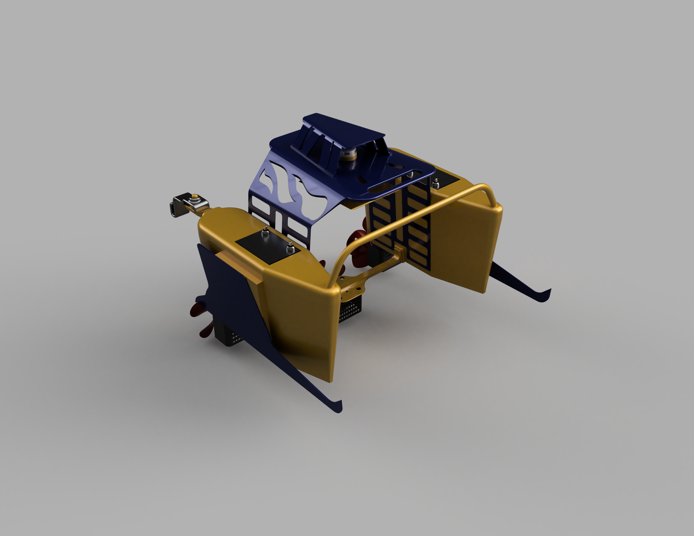
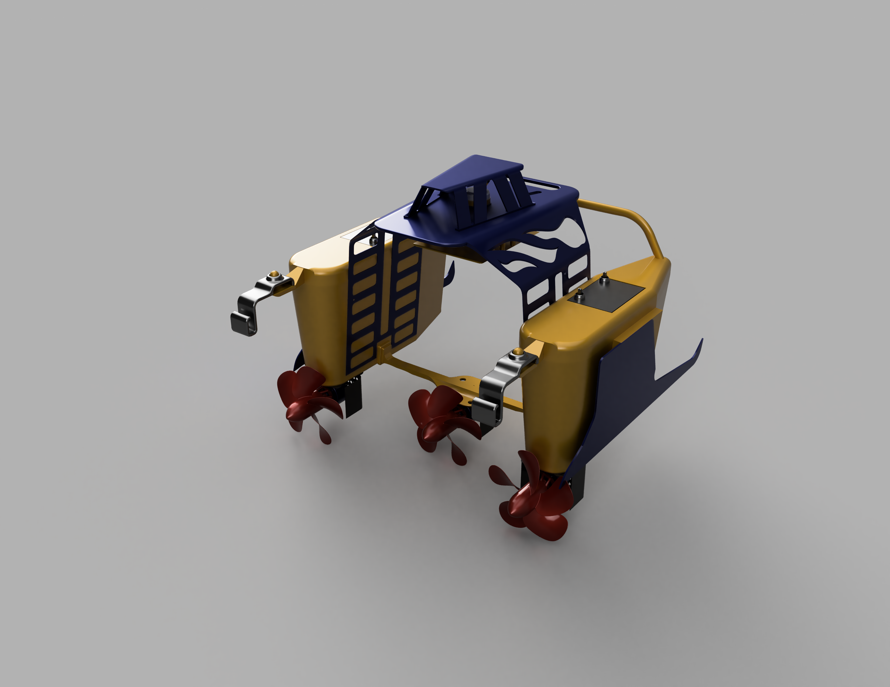

# Automated Pond Cleaning Project

 

## Overview

Welcome to the Pond Cleaning Bot project repository! This initiative aims to address the challenge of automatically cleaning marine surfaces from floating wastes in ponds. The Pond Cleaning Bot is designed with a net holder to effectively collect and remove debris, contributing to a cleaner aquatic environment.

  

### Project Motive

Marine pollution poses a significant threat to ecosystems, and this project seeks to provide an innovative solution for cleaning floating film wastes on the pond surface autonomously. By automating the process, we aim to contribute to the preservation of aquatic life and the overall health of pond ecosystems.

### Project Features

- **Automated Cleaning:** The Pond Cleaning Bot autonomously navigates pond surfaces, collecting floating debris with its net holder.
- **Efficient Design:** The CAD design, created using Fusion 360, ensures optimal functionality and maneuverability.
- **Environmental Impact:** By reducing marine debris, the project aims to positively impact the pond's ecosystem.

### Project Progress

#### Mechanical Design

The CAD design for the Pond Cleaning Bot is well underway. Explore the detailed components and structure in the CAD files located in the [mechanical_design](https://grabcad.com/library/pond-waste-remover-bot-1) directory.

Feel free to explore these GIFs to witness the progress and capabilities of the Pond Cleaning Bot.

  

## Getting Started

To get started with the project, follow these steps:

### Simulation Part:

1. Download the CAD file from grabCAD and organize the joints in a parant child relation tree.
2. Keep the main frame of the bot as a root of the tree of parant child relationship.
3. Convert the .f3d to URDF from Fusion 360 using fusion2urdf plugin. You will find further details [here](https://github.com/syuntoku14/fusion2urdf).
4. Use the URDF for simulations in Simulating Softwares Like [Gazebo 11](https://gazebosim.org/home).

### Power Distribution Part

1. You can re-edit the model for more practical appearance. I didn't fixed the [joint mechanisms in the model](https://www.tandfonline.com/doi/full/10.1080/01691864.2020.1813624).
2. Apply actuators and move the actuators from Electrical power lines with feedback loop of the joint motion. There is already placeholders for batteries.

### Navigation and Feedback action stack

This part will be worked after we completetly build the mechanical and electrical power distribution all practical actuators in the model.
But you are welcome to do the work on perception stack early on. Let me know your progess and let's collaborate. It should detect wastes on the pond navigate in such a way that it catches the pollution in the net. 
